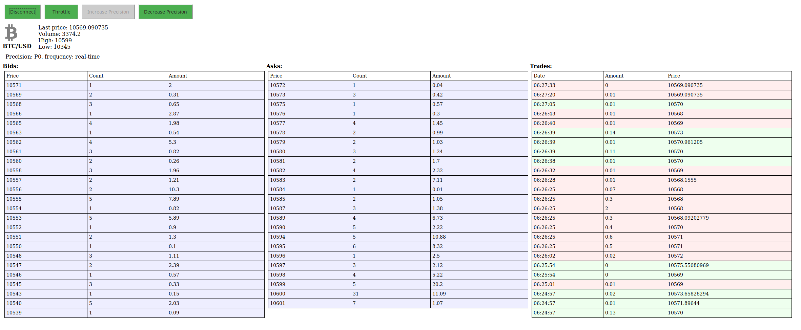

# Bitfinex demo task

## Overview
This is a test assignment I did while being interviewed at Bitfinex for Senior Frontend Developer position in 2017.

The task was to write a simple one-page web application that connects to the Bitfinex websocket API and displays the following information for the `BTC/USD` trading pair:
* **ticker**: current price, volume, daily low and high
* **order book**
* **last trades**

This is what it finally looked like:

## Building

### Prerequisites
The latest minor version of node 8LTS with the bundled npm version are recommended to run the project. At the moment of writing the project was built with node v8.16.1 and npm v6.4.1.
 
### Getting started
Install the dependencies

`npm install`

### Run commands
`npm run start` - To start the application in development mode. The port is 8888 by default, you can override it by setting 
`BITFINEX_PORT` env. variable.

`npm run build` - To create a minified build for production usage

`npm run lint` - To perform code style check
